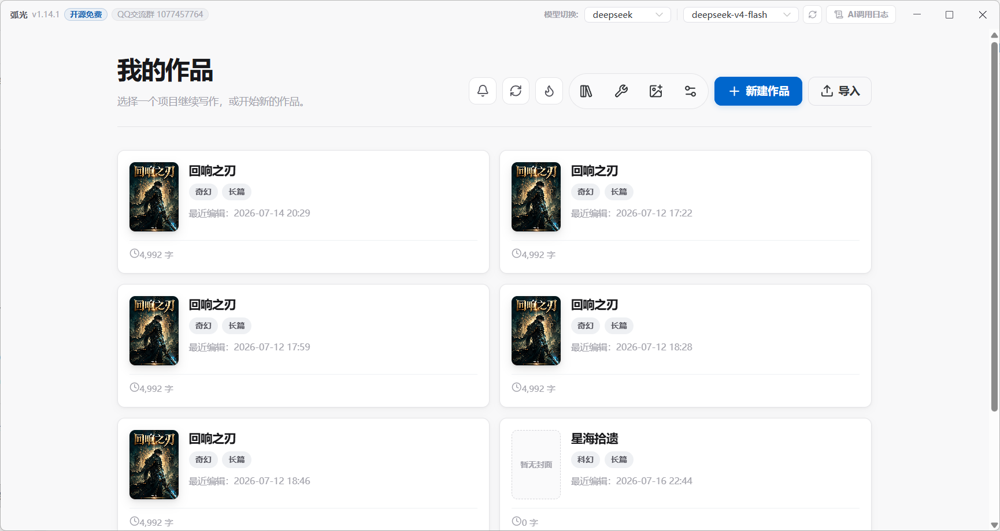
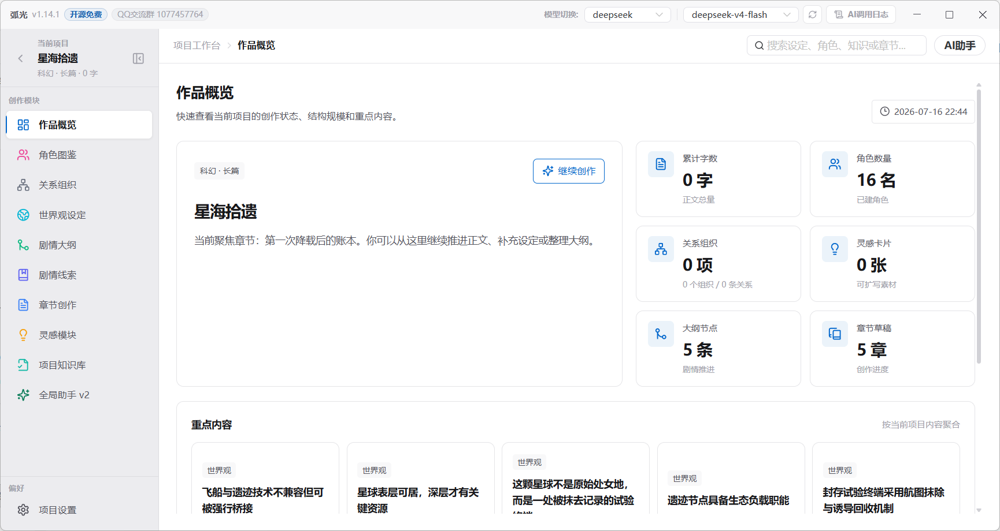
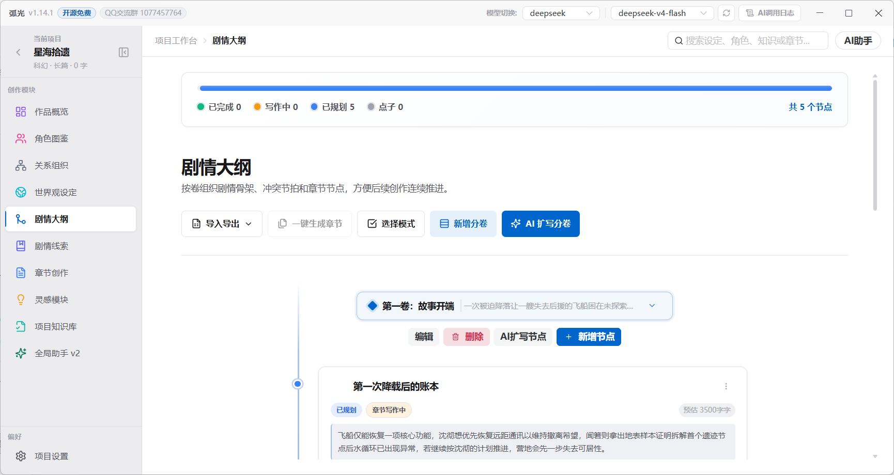
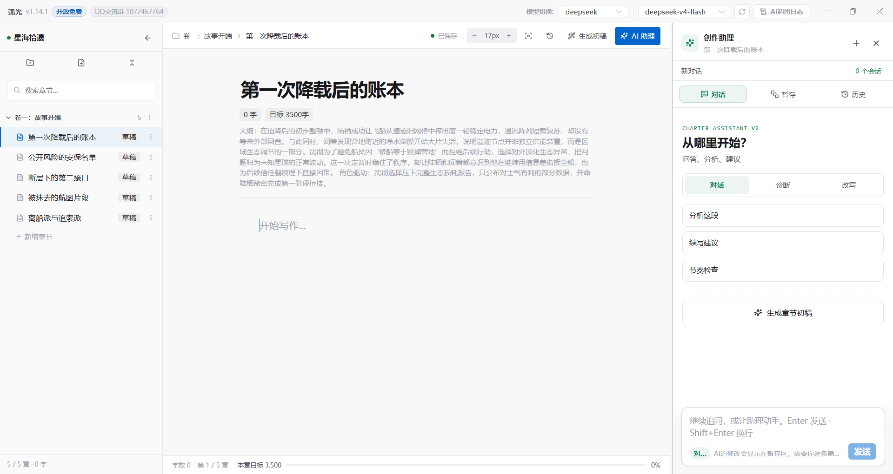
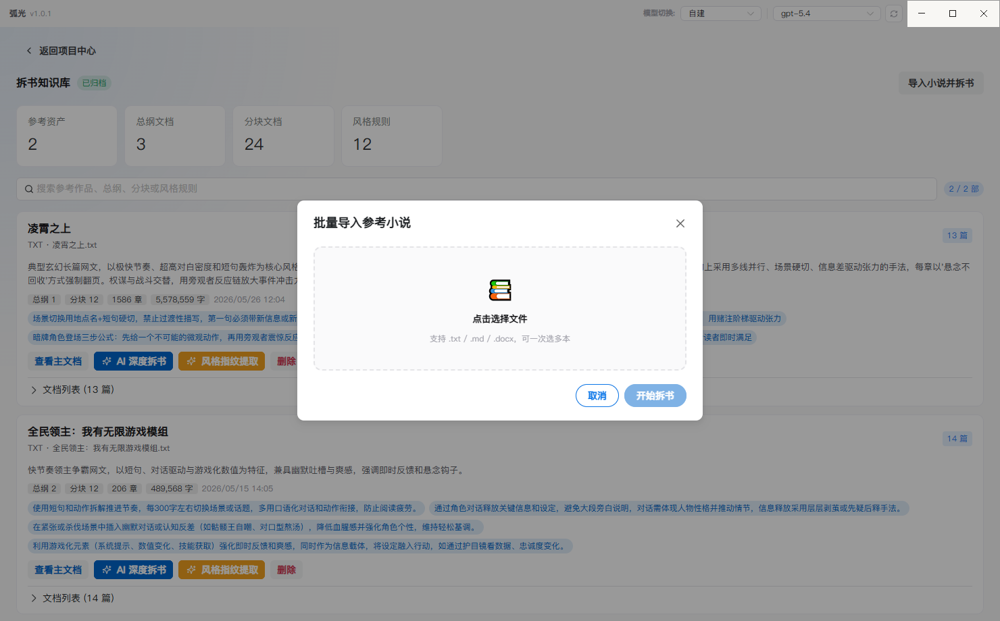
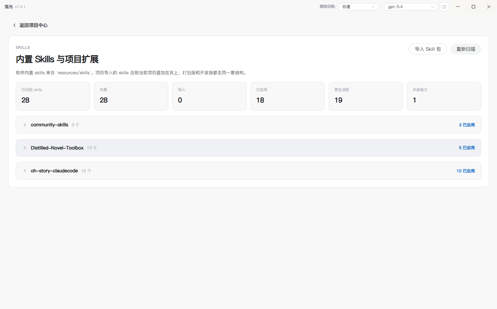
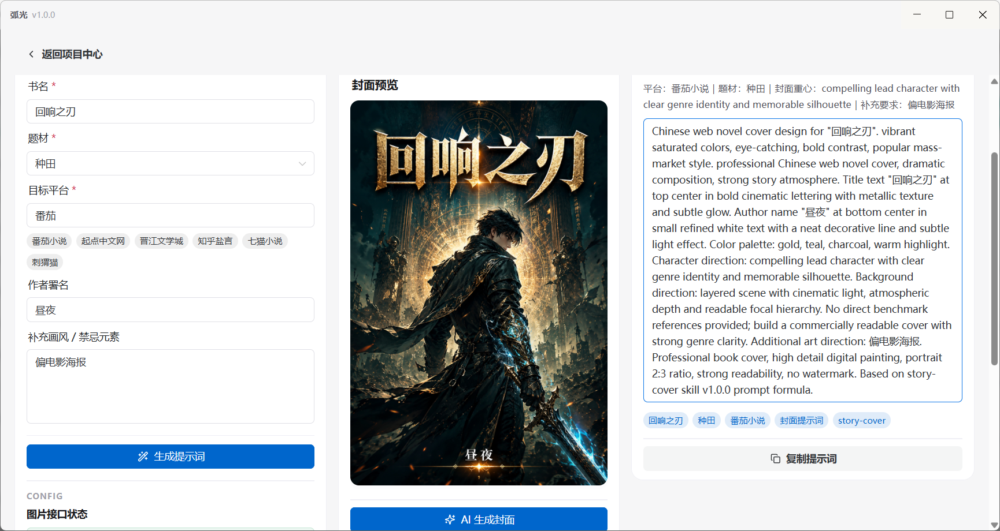

<div align="center">


# CharacterArc

### 弧光 · 本地优先的 AI 小说创作桌面工作台

把项目设定、人物关系、剧情大纲、章节写作和 AI 协作放进同一个创作空间。

<p>
  
  
  
  
  
</p>

<p>
  <a href="#产品定位">产品定位</a> ·
  <a href="#核心能力">核心能力</a> ·
  <a href="#使用方式">使用方式</a> ·
  <a href="#开发与构建">开发与构建</a> ·
  <a href="#项目结构">项目结构</a>
</p>

</div>

---

## 产品定位

CharacterArc（弧光）是一款面向长篇与短篇小说创作者的桌面应用。它不是单纯的 AI 对话界面，而是围绕“资料沉淀 → 结构规划 → 章节写作 → 审阅修订”搭建的完整创作工作台。

- **本地优先**：项目、章节、知识文档和助手会话保存在本机 SQLite 数据库中。
- **项目隔离**：每部作品独立维护设定、人物、关系、大纲、章节、知识库与运行记录。
- **章节导向**：设定、灵感、剧情线和 AI 能力最终都服务于正文创作。
- **人机协作**：AI 的结构化修改先进入暂存区，由作者审阅后再写回项目。
- **模型开放**：支持 OpenAI 兼容协议和 Anthropic 协议，可接入官方服务、自定义网关或本地模型服务。

## 核心能力

### 从零创建作品

通过新建项目向导填写题材、篇幅和故事简介，也可以让 AI 按“骨架 → 展开 → 校验”的流程生成首批世界观、人物和剧情大纲。

### 导入已有小说继续写

“小说续写”工作流支持导入 TXT 小说，自动识别常见中文编码并拆分章节。导入前可以校对标题与正文、调整顺序、拆分、合并或删除章节，还可以让 AI 整理：

- 章节摘要与全书概要
- 人物卡片、组织势力和人物关系
- 全书大纲与分卷大纲
- 待回收伏笔、剧情线和当前续写状态
- 既有章节中的世界状态与叙事记忆

状态补录任务在主进程后台运行，支持按章节记录进度、暂停、恢复和失败重试。

### 管理故事资料

- 世界观、角色、组织和人物关系
- 可视化关系图谱
- 灵感素材、剧情线、伏笔与回收计划
- 创作记忆、项目约束和知识文档
- 参考作品拆解、风格分析与知识沉淀
- 大纲分卷、节点拖拽、批量操作及 Excel 导入导出

### 完成章节写作

章节工作台采用“目录树 + 正文编辑器 + AI 侧边栏”的三栏布局，提供：

- 基于 TipTap 的富文本编辑器
- 按大纲节点创建章节并继承摘要与字数目标
- 章节和分卷拖拽排序
- 自动保存、异常退出草稿恢复、手动快照和历史版本回滚
- 查找替换、右键菜单、阅读模式、专注模式和字体设置
- TXT / DOCX 章节导出
- 写作备忘、初稿、审计、修复、去机械感和写作日志组成的章节工作流

### 使用 AI 创作助手

全局助手 v2 可以读取当前项目资料和章节上下文，完成问答、分析和结构化编辑。涉及项目数据的修改会先生成暂存变更，作者可以查看差异、接受或拒绝，再决定是否写回。

章节侧 AI 能力包括续写、改写、润色、节奏调整、场景规划、章节分析、摘要生成和伏笔识别。后台任务面板会统一显示任务进度、历史记录和错误信息。

应用兼容多种模型的推理字段，并在正文落盘前清理常见思考标记，降低推理过程混入正文的风险。

### 使用 Skill 扩展写作能力

当前版本内置 3 组、共 29 个 Skill，覆盖长短篇写作、故事分析、人物设计、世界观、节奏、情绪、爽点、商业化、合规、风格提取和去 AI 味等场景。

| 来源 | 数量 | 主要方向 |
| --- | ---: | --- |
| `oh-story-claudecode` | 13 | 故事搭建、导入、长短篇写作与分析、审阅、封面、浏览器辅助 |
| `community-skills` | 3 | 中文润色、风格指纹、风格融合 |
| `Distilled-Novel-Toolbox` | 13 | 题材、人设、世界观、节奏、情绪、爽点、商业化与合规 |

应用会扫描 `resources/skills/<来源>/<skill-id>/SKILL.md`。你也可以为单个项目导入额外的 Skill 包，不影响其他作品。

### 生成作品封面

封面工作台可以针对番茄、起点、晋江、知乎盐言、七猫、刺猬猫等平台生成封面提示词，并调用已配置的图像模型生成预览、对比历史版本。

## 界面预览

<table>
  <tr>
    <td width="50%" align="center">
      <a href="docs/assets/homepage.png"></a>
      <br /><sub><b>项目中心</b> · 管理作品、导入归档和进入续写流程</sub>
    </td>
    <td width="50%" align="center">
      <a href="docs/assets/overview.png"></a>
      <br /><sub><b>作品概览</b> · 汇总设定资产、章节进度和重点内容</sub>
    </td>
  </tr>
  <tr>
    <td width="50%" align="center">
      <a href="docs/assets/story_line.png"></a>
      <br /><sub><b>剧情大纲</b> · 按分卷组织节点并支持拖拽与批量整理</sub>
    </td>
    <td width="50%" align="center">
      <a href="docs/assets/chapter_creation.png"></a>
      <br /><sub><b>章节创作</b> · 目录、正文与 AI 助手协同工作</sub>
    </td>
  </tr>
  <tr>
    <td width="50%" align="center">
      <a href="docs/assets/book_disassembly.png"></a>
      <br /><sub><b>参考作品拆解</b> · 沉淀结构、风格与知识条目</sub>
    </td>
    <td width="50%" align="center">
      <a href="docs/assets/skills_show.png"></a>
      <br /><sub><b>Skill 系统</b> · 为不同创作任务加载专用方法与规则</sub>
    </td>
  </tr>
  <tr>
    <td colspan="2" align="center">
      <a href="docs/assets/cover_design.png"></a>
      <br /><sub><b>封面工作台</b> · 生成平台化提示词和封面预览</sub>
    </td>
  </tr>
</table>

## 使用方式

### 下载安装

前往当前仓库的 [GitHub Releases](https://github.com/Nicco-zxw/character-wenxin-main/releases) 获取已发布版本；请以 Releases 页面实际提供的产物为准。

- Windows 构建产物为 NSIS 安装程序。
- macOS 构建产物为 DMG / ZIP；当前自动构建采用 ad-hoc 签名且未公证，首次运行可能需要在系统设置中手动允许。
- 仓库保留 Linux AppImage / DEB 构建配置，但请以具体 Release 是否提供对应产物为准。

### 配置文本模型

首次启动后，在“设置”中新增一套文本模型配置：

1. 选择 `OpenAI 兼容协议` 或 `Anthropic 协议`。
2. 填写 Base URL、API Key 和模型名称。
3. 如服务支持模型列表接口，可以直接拉取可用模型。
4. 保存后可在标题栏快速切换不同配置。

OpenAI 兼容配置可用于 DeepSeek、通义千问、智谱 GLM、Kimi、SiliconFlow、Ollama 及兼容网关。实际可用能力取决于模型和服务商是否支持流式输出、结构化结果、工具调用与推理字段。

封面生成功能需要单独配置图像模型、Base URL 和 API Key。

> 请勿在截图、Issue 或日志中公开 API Key。CharacterArc 不提供模型额度，调用费用和数据处理规则由你选择的模型服务商决定。

### 推荐创作流程

```text
创建作品或导入旧稿
        ↓
整理世界观、人物、关系与参考资料
        ↓
规划分卷和剧情节点
        ↓
按大纲创建章节并完成初稿
        ↓
审计、修订、状态沉淀与伏笔跟踪
        ↓
导出正文或备份项目归档
```

### 数据、备份与隐私

应用数据默认位于 Electron 的用户数据目录：

```text
<userData>/data/workspace.db
<userData>/project-skills/<project-scope>/
```

- 工作区使用本机 SQLite 持久化。
- 完整项目可以导出为 `.carc` 归档，用于备份、迁移和恢复。
- 应用本身不要求 CharacterArc 云端账号，也没有自有内容同步服务。
- 当你主动使用 AI 功能时，任务所需的提示词和相关创作上下文会发送到你配置的模型服务商；请按服务商隐私政策选择接口。

## 开发与构建

### 环境要求

- Node.js `^20.19.0` 或 `>=22.12.0`
- pnpm `10.33.2`（项目在 `package.json` 中声明的版本）
- Windows、macOS 或 Linux 开发环境

### 本地启动

```bash
git clone https://github.com/Nicco-zxw/character-wenxin-main.git
cd character-wenxin-main

pnpm install
pnpm run dev
```

`pnpm run dev` 会启动 Electron 主进程、preload 脚本和 Vue 渲染进程。

### 常用命令

| 命令 | 用途 |
| --- | --- |
| `pnpm run dev` | 启动开发环境 |
| `pnpm run typecheck` | 执行 Vue / TypeScript 类型检查 |
| `pnpm test` | 运行 Node.js 测试套件（会先执行 `pretest`） |
| `pnpm run build` | 类型检查后构建应用 |
| `pnpm run preview` | 预览已构建应用 |
| `pnpm run dist` | 为当前平台构建安装包 |
| `pnpm run dist:win` | 构建 Windows NSIS 安装程序 |
| `pnpm run dist:mac` | 构建 macOS DMG / ZIP |
| `pnpm run eval` | 运行本地评估集 |
| `pnpm run eval:llm` | 运行需要模型配置的 LLM 评估 |

建议在提交变更前至少执行：

```bash
pnpm run typecheck
pnpm test
```

### 技术栈

| 层 | 技术 |
| --- | --- |
| 桌面运行时 | Electron 37 |
| 前端 | Vue 3.5、TypeScript 5.9、Pinia 3 |
| UI | Naive UI、Lucide、深浅色主题系统 |
| 编辑器 | TipTap 3 |
| 构建 | electron-vite 4、Vite 7、electron-builder 26 |
| 持久化 | Node.js SQLite（Electron 主进程） |
| AI | Vercel AI SDK、OpenAI Provider、Anthropic Provider |
| 图谱 | Cytoscape |
| 文档处理 | DOCX、XLSX、Markdown、ZIP |

## 项目结构

```text
character-arc/
├─ electron/
│  ├─ main/
│  │  ├─ ai/                 # AI 任务、上下文、Skill、Agent 与 Runtime v2
│  │  ├─ archive/            # .carc 项目归档导入导出
│  │  ├─ index.ts            # Electron 主进程入口
│  │  ├─ register-main-ipc.ts
│  │  ├─ window-manager.ts
│  │  └─ workspace-store.ts  # SQLite 建表、迁移与工作区读写
│  ├─ preload/               # 安全的 IPC 桥接层
│  └─ shared/                # 主进程与渲染进程共享类型及逻辑
├─ renderer/src/
│  ├─ components/            # 通用和业务组件
│  ├─ features/              # AI、章节、知识库、关系、封面等功能模块
│  ├─ pages/                 # 页面级视图
│  ├─ stores/                # Pinia 状态管理
│  └─ styles/                # 全局样式和主题
├─ resources/
│  ├─ skills/                # 内置 Skill 包
│  └─ icon.*                 # 应用图标
├─ scripts/eval/             # 本地与 LLM 评估脚本
├─ docs/                     # 截图和版本说明
├─ electron.vite.config.ts
└─ package.json
```

### 运行架构

```text
Vue 渲染进程
  ├─ 页面、编辑器与 Pinia Store
  └─ window.characterArc
             │
             ▼
        Preload IPC 桥
             │
             ▼
Electron 主进程
  ├─ SQLite 工作区与项目归档
  ├─ AI 请求、任务调度与知识检索
  ├─ Assistant Runtime v2 与暂存变更
  └─ 文件、窗口及系统能力
```

渲染进程不直接访问 Node.js 能力。文件操作、数据库读写和模型请求统一经由 preload 暴露的 IPC 接口进入主进程。

### 打包说明

`package.json` 中配置了以下产物：

- Windows：NSIS 安装程序，可选择安装目录，支持简体中文和英文安装界面。
- macOS：DMG 和 ZIP，分别支持目标机器对应的架构。
- Linux：AppImage 和 DEB。

`.github/workflows/release.yml` 提供 macOS 自动构建。当前 macOS 配置为 ad-hoc 签名；若用于正式分发，需要补充 Developer ID 签名和 notarization 所需的 GitHub Secrets。

## 更新记录

完整版本历史见 [CHANGELOG.md](CHANGELOG.md)。

当前版本 `v1.15.5` 的重点包括：

- 小说续写导入与 AI 资料初始化
- 故事状态补录、后台执行、暂停恢复和按章重试
- 项目知识库隔离与旧数据归属迁移
- 大规模资料列表增量渲染和工作台性能优化

## 鸣谢

- [oh-story-claudecode](https://github.com/worldwonderer/oh-story-claudecode) 提供核心写作 Skills 的方法论与 Prompt 工程基础。
- [Distilled-Novel-Toolbox](https://github.com/dama-cyber/Distilled-Novel-Toolbox) 提供网文创作工作流和知识体系参考。
- [FanqieRankTracker](https://github.com/uu201/FanqieRankTracker) 提供番茄榜单数据来源。

## 社区交流

<a href="https://qm.qq.com/q/lTQfy3AYvY"></a>

[点击加入 QQ 群](https://qm.qq.com/q/lTQfy3AYvY) · [LINUX DO 社区](https://linux.do)

## License

[MIT](LICENSE) © zhouyeshan

<div align="center">

如果 CharacterArc 对你的创作有帮助，欢迎 Star 支持。

</div>
